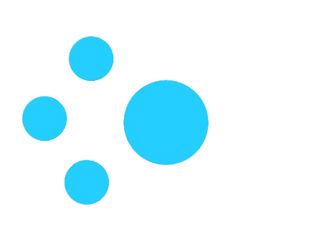

<!--  -->

<h1 align="center">Hi dear 👋, I'm Ernane Ferreira</h1></h1>

  
  
  
 
  
  
  

 
<h3 align="center"> 
	A great dreamer and technology enthusiast.
</h3>
&nbsp;
<h4> 
	
  - 🔭 I’m currently working on [Real Seguro Viagem](https://www.seguroviagem.srv.br/);
	
  - 👨‍💻 Some of my projects are available [here](https://github.com/ErnaneJ?tab=repositories);
	
  - 📚 This is my simple [blog](https://blog.ernane.dev/);
	
  - ✨ And here's more information [about me](https://www.ernane.dev/#sobre).
	
</h4>
 
&nbsp;

  <!-- javascript -->
  
   <!-- jquery -->
    
  <!-- html5 -->
  
  <!-- css3 -->
  
  <!-- bootstrap -->
  
  <!-- c++ -->
  
  <!-- java -->
  
    <!-- ruby -->
  
  <!-- svelte -->
 
  <!-- React -->
  
 <!-- nodejs -->
  
  <!-- Python -->

  <!-- loading... -->
  

&nbsp;

<table align='left'>
  <row>
    <td>
     <!-- Card -->
      
    </td>
    <td>
      
    </td>
  </row>
</table>

<!-- 
 -->
  <!-- Snake -->
  <!--  -->
<!-- 
 -->

 
